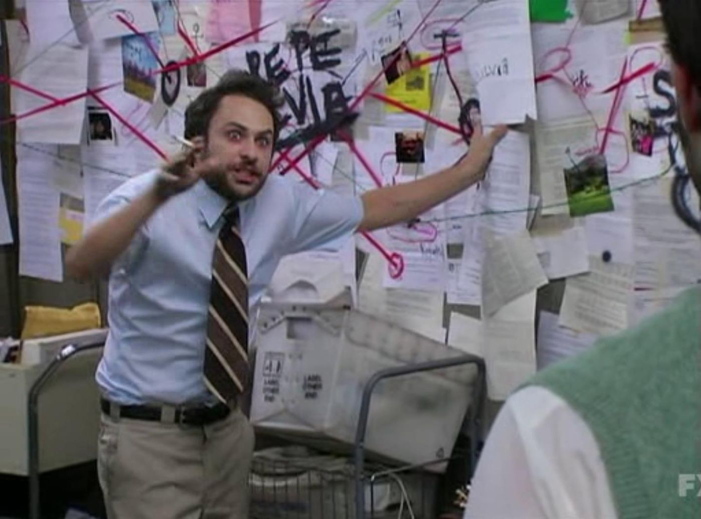

# Project Machin
par Yannick Antoine

## Biographie
Nam imperdiet neque dui, ac fringilla ex scelerisque et. Integer consectetur diam urna, sit amet blandit nisl rutrum eu. Suspendisse mollis quam ut dolor porta tempus. Sed ac ipsum varius, faucibus diam in, convallis purus.

## Note d'intention
Orci varius natoque penatibus et magnis dis parturient montes, nascetur ridiculus mus. Vestibulum sodales neque ac porta venenatis. Vestibulum ut sapien interdum, dapibus leo ac, faucibus augue. Pellentesque et rhoncus enim, non semper nunc. Aliquam nec faucibus enim. Integer ut tempor nulla. Sed efficitur elit et eleifend maximus. Maecenas vestibulum eget nunc eu fringilla.

Aliquam lobortis tempor urna eget sodales. Phasellus iaculis id purus sed bibendum. Proin quis porttitor libero. Donec vitae quam pharetra, tincidunt lacus id, gravida ipsum. Phasellus pretium laoreet velit, vel eleifend nulla finibus non. Quisque ut quam nunc. Vivamus elementum tellus sit amet erat tincidunt, ut lobortis lacus dignissim. Ut tempor tristique augue, vel viverra magna efficitur et. Aliquam erat volutpat. Vestibulum ut sapien vel tellus dignissim laoreet. Nunc sodales id felis nec lobortis. Cras luctus, purus non maximus molestie, dolor felis vehicula mauris, eleifend tempus purus velit nec lectus.

## Synopsis
Aenean suscipit elementum tincidunt. Praesent mattis posuere dolor, sed semper lorem vulputate ac. Proin bibendum posuere nunc, id mollis urna auctor ut. Mauris egestas diam eget enim scelerisque, eu malesuada augue pharetra. Vestibulum dapibus feugiat ligula, nec pretium nisi faucibus eget. Morbi vel convallis odio. Ut odio urna, malesuada at semper vitae, finibus eu lacus. Etiam tempus mattis ante. Pellentesque sollicitudin tortor id lacus pharetra interdum. Sed vestibulum finibus risus. Praesent placerat erat nec orci dignissim pretium.

Donec venenatis sit amet diam non placerat. Suspendisse tempor venenatis bibendum. Sed nec tortor volutpat, rutrum justo ut, congue metus. Nullam porttitor nec tortor eget ultricies. In interdum dictum nisl, ut viverra erat. Ut massa lectus, posuere ac mollis eu, rhoncus vel mi. Praesent sed magna rhoncus, pulvinar lectus sed, lobortis elit.

## Positionnement artistique
Blabla

## Matériel, des logiciels, des médias, et des techniques utilisés
C'est un peu compliqué alors j'ai fait un schéma

Comment j'ai fait pour insérer une image? [C'est très simple!](https://github.com/stluc-an/Ephemere-furtif/blob/master/markdown-images.md)

## État d'avancement
Suspendisse blandit interdum nulla eu tincidunt. Sed egestas sodales nisl quis fermentum. Cras posuere, nunc sit amet congue sodales, tellus mauris accumsan lectus, vel molestie sem magna eget turpis. Nam ut metus lacinia, imperdiet nisl eget, luctus mi. Vestibulum consequat, dui at convallis lobortis, justo leo bibendum arcu, ut placerat eros nisi quis lacus. 
Sed aliquet, sem sit amet consectetur placerat, nibh enim bibendum sapien, id pharetra augue ipsum id metus. Fusce posuere orci ac malesuada accumsan. 
Ut dictum suscipit ornare. Lorem ipsum dolor sit amet, consectetur adipiscing elit. Fusce viverra, turpis vel rutrum mollis, massa purus gravida est, quis pulvinar libero purus a lorem. Donec dolor sapien, pellentesque luctus purus id, vulputate volutpat sem. 
Donec ut condimentum tortor. Curabitur imperdiet eget felis ac scelerisque.

## Calendrier de production